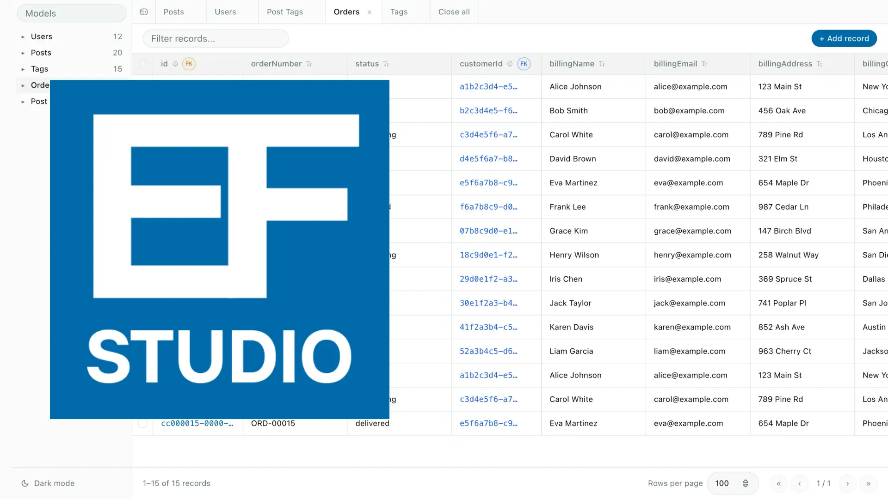

<p align="center">
  
</p>

<p align="center">
  Visual database browsing for EF Core apps.
</p>

<p align="center">
  <a href="https://github.com/Calesi19/EFStudio/releases">
    
  </a>
  <a href="https://github.com/Calesi19/EFStudio/actions/workflows/publish-nuget.yml">
    
  </a>
  <a href="https://github.com/Calesi19/EFStudio/actions/workflows/pipeline.yml">
    
  </a>
</p>

**EFStudio** is a minimal, plug-and-play visual database browser for EF Core apps. It lets you inspect schema and records directly from your browser with a single line of configuration in your ASP.NET Core application.



## Features

- **Auto-Discovery**: Automatically maps your `DbContext`, EF Core entities, and PostgreSQL schemas.
- **Zero Config**: No separate installation or database connection strings required. It uses your existing EF Core setup.
- **Read-Only Browsing**: View and filter records through an embedded interface without enabling writes.
- **Development-Only**: Designed as a middleware that only runs in the `Development` environment.

## Installation

Install the NuGet package via the .NET CLI:

```bash
dotnet add package EFStudio
```

## Quick Start

Enable EFStudio in your `Program.cs` file by registering it with your EF Core `DbContext`, then adding the middleware to the pipeline:

```csharp
using EFStudio.Core.Extensions;
using Microsoft.EntityFrameworkCore;

var builder = WebApplication.CreateBuilder(args);

builder.Services.AddDbContext<AppDbContext>(options =>
    options.UseNpgsql(builder.Configuration.GetConnectionString("DefaultConnection"))
);

builder.Services.AddEFStudio<AppDbContext>();

var app = builder.Build();

if (app.Environment.IsDevelopment())
{
    app.UseEFStudio();
}

app.Run();
```

By default, the studio will be available at `/efstudio` (e.g., `http://localhost:5000/efstudio`).

## Why EFStudio?

1. **Context Aware**: It understands your EF Core relations, navigations, and mapped schemas.
2. **Minimal Footprint**: No need to manage credentials or connection strings in multiple places; if your API can connect to the DB, the Studio can too.
3. **Workflow Integration**: Keep database inspection in the same lifecycle as your API development.

## Requirements

- .NET 6.0 or higher
- Entity Framework Core 6.0+
- EF Core provider for your database
- `Npgsql.EntityFrameworkCore.PostgreSQL` for PostgreSQL
- `Microsoft.EntityFrameworkCore.Sqlite` for SQLite

## Database Support

| Database | Status |
| --- | --- |
| PostgreSQL | ✅ Supported |
| SQLite | ✅ Supported |
| SQL Server | 🚧 Coming in the future |
| MySQL | 🚧 Coming in the future |
| MariaDB | 🚧 Coming in the future |
| Oracle Database | 🚧 Coming in the future |

## Contributing

See [CONTRIBUTE.md](./CONTRIBUTE.md) for local setup, development workflow, and pull request guidance.

## License

MIT License - Copyright (c) 2026
